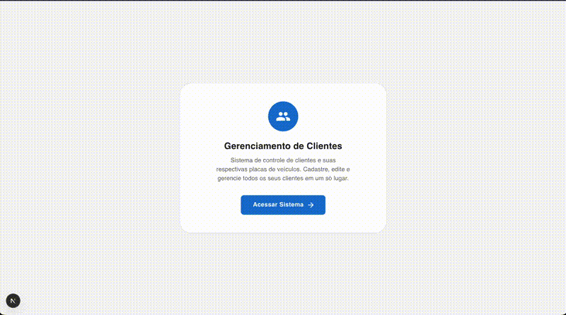

# ClienteCar - Sistema de Gerenciamento de Clientes

Sistema de controle de clientes e suas respectivas placas de veículos. Permite cadastrar, editar, visualizar e excluir clientes com validação de dados.

## Demonstração



## Como Rodar o Projeto

### Pré-requisitos

- Node.js 18+
- Yarn ou npm

### Instalação

```bash
# Clone o repositório
git clone https://github.com/seu-usuario/light-base-frontend.git

# Acesse a pasta
cd light-base-frontend

# Instale as dependências
yarn install

# Rode o projeto
yarn dev
```

Acesse [http://localhost:3000](http://localhost:3000)

### Scripts Disponíveis

| Comando              | Descrição                            |
| -------------------- | ------------------------------------ |
| `yarn dev`           | Inicia o servidor de desenvolvimento |
| `yarn build`         | Gera build de produção               |
| `yarn start`         | Inicia o servidor de produção        |
| `yarn test`          | Executa testes em modo watch         |
| `yarn test:run`      | Executa testes uma vez               |
| `yarn test:coverage` | Executa testes com cobertura         |
| `yarn lint`          | Verifica erros de lint               |
| `yarn format`        | Formata o código                     |

## Tecnologias Utilizadas

### Core

| Tecnologia                                    | Versão | Finalidade                                                       |
| --------------------------------------------- | ------ | ---------------------------------------------------------------- |
| [Next.js](https://nextjs.org/)                | 16     | Framework React com App Router, SSR e otimizações de performance |
| [React](https://react.dev/)                   | 19     | Biblioteca para construção de interfaces                         |
| [TypeScript](https://www.typescriptlang.org/) | 5      | Tipagem estática para maior segurança e DX                       |

### UI & Estilização

| Tecnologia                            | Finalidade                                                |
| ------------------------------------- | --------------------------------------------------------- |
| [Material UI (MUI)](https://mui.com/) | Componentes seguindo Material Design com tema customizado |
| [Emotion](https://emotion.sh/)        | CSS-in-JS para estilização de componentes                 |

### Formulários & Validação

| Tecnologia                                      | Finalidade                                              |
| ----------------------------------------------- | ------------------------------------------------------- |
| [React Hook Form](https://react-hook-form.com/) | Gerenciamento de formulários com performance otimizada  |
| [Zod](https://zod.dev/)                         | Validação de schemas com inferência de tipos TypeScript |

### Persistência de Dados

| Tecnologia                                                         | Finalidade                                             |
| ------------------------------------------------------------------ | ------------------------------------------------------ |
| [Dexie.js](https://dexie.org/)                                     | Wrapper para IndexedDB com API simplificada            |
| [dexie-react-hooks](https://dexie.org/docs/libs/dexie-react-hooks) | Hooks reativos para queries com atualização automática |

### Testes

| Tecnologia                                                         | Finalidade                                       |
| ------------------------------------------------------------------ | ------------------------------------------------ |
| [Vitest](https://vitest.dev/)                                      | Framework de testes rápido e compatível com Vite |
| [Testing Library](https://testing-library.com/)                    | Testes focados no comportamento do usuário       |
| [fake-indexeddb](https://github.com/nicholasjhenry/fake-indexeddb) | Mock do IndexedDB para testes                    |

### Qualidade de Código

| Tecnologia                                                | Finalidade                                   |
| --------------------------------------------------------- | -------------------------------------------- |
| [ESLint](https://eslint.org/)                             | Linting para identificar problemas no código |
| [Prettier](https://prettier.io/)                          | Formatação consistente do código             |
| [Husky](https://typicode.github.io/husky/)                | Git hooks para validação no pre-commit       |
| [lint-staged](https://github.com/lint-staged/lint-staged) | Executa linters apenas em arquivos staged    |

### Error Handling

| Tecnologia                                                              | Finalidade                                      |
| ----------------------------------------------------------------------- | ----------------------------------------------- |
| [react-error-boundary](https://github.com/bvaughn/react-error-boundary) | Captura de erros em componentes com fallback UI |

## Arquitetura do Projeto

```
src/
├── app/                    # Rotas (Next.js App Router)
│   ├── clients/            # Páginas de clientes (CRUD)
│   └── page.tsx            # Home
├── components/
│   ├── layout/             # AppLayout, PageHeader
│   ├── patterns/           # EmptyState, LoadingState, ErrorFallback
│   └── ui/                 # MaskedField, SearchField, InfoItem
├── features/
│   └── clients/            # Feature de clientes
│       ├── components/     # ClientCard, ClientForm, ClientList
│       ├── hooks/          # useClientActions, useClientQueries
│       ├── schemas/        # Validação Zod
│       └── types/          # Tipos TypeScript
├── hooks/common/           # Hooks reutilizáveis
├── providers/              # Context providers globais
├── services/               # Camada de dados (Dexie)
│   └── errors/             # Erros customizados
├── helpers/                # Formatadores, máscaras, validadores
├── constants/              # Rotas, constantes
└── styles/                 # Tema MUI customizado
```

## Funcionalidades

- ✅ Listagem de clientes com busca
- ✅ Cadastro de cliente com validação
- ✅ Edição de cliente
- ✅ Exclusão com confirmação
- ✅ Visualização de detalhes
- ✅ Máscaras de input (CPF, telefone, placa)
- ✅ Validação de CPF
- ✅ Persistência local (IndexedDB)
- ✅ Interface responsiva
- ✅ Acessibilidade (ARIA, keyboard navigation)
- ✅ Feedback visual (loading, empty states, erros)
- ✅ Testes unitários e de integração

## Padrões Utilizados
